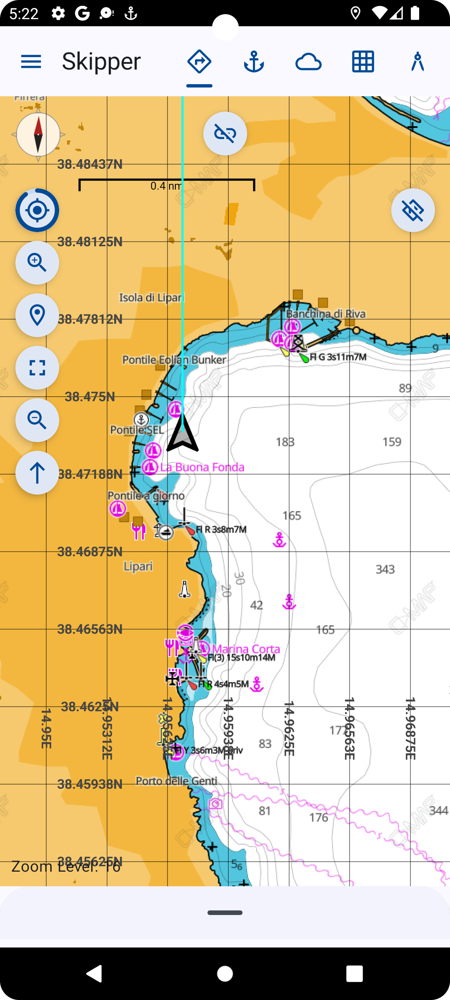
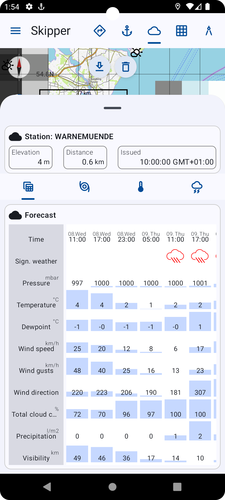
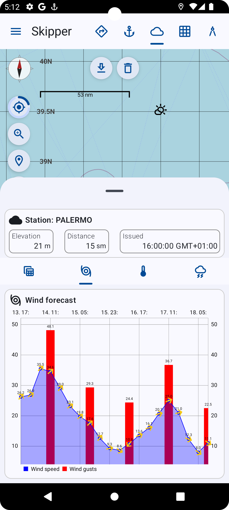
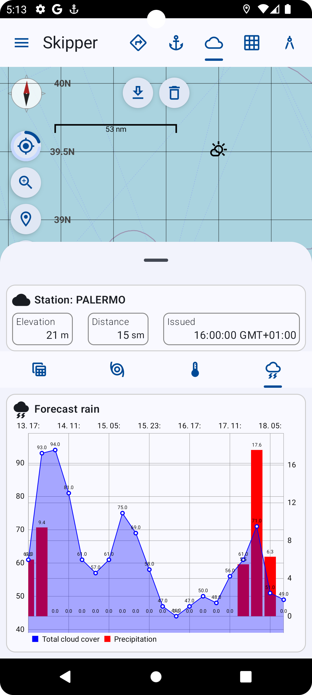
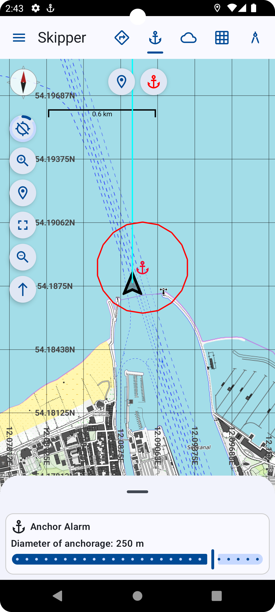
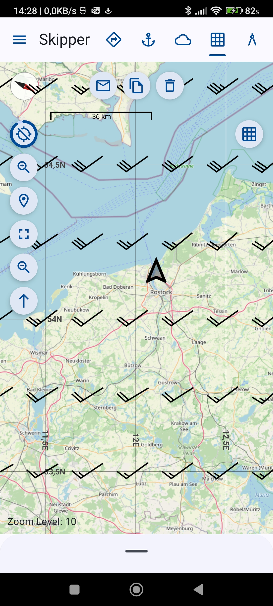
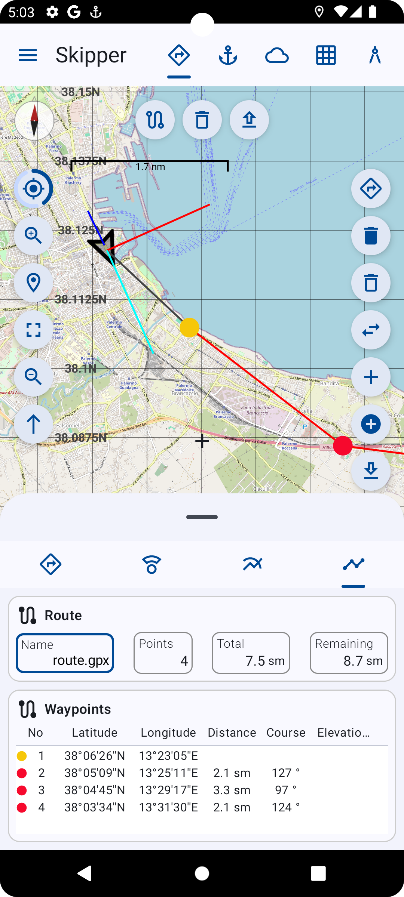

# The Skipper development project

Skipper is a development project with special emphasis on navigation for boating people. It's an Android app, which 
includes the following features:

- using OSM maps (Mapnik, OpenSeamap and Topo)
- external maps in mbtiles format can be imported
- Skipper tracks and uses routes for navigation
- tracks and routes can be (im|ex)ported in GPX format
- SKipper retrieves world wide weather information from German DWD weather service with thousand of stations worldwide
- It also can load GRIB files (V1/V2 version) from Saildocs service
- It also has a celestial navigation support

## Screen shots (OpenSea Map, Topo Map, C-Map)

  

## Screen shots (Weather Info, Wind Forecast, Rain Forecast)

  

## Screen shots (Anchor Alarm, GFS Grib File, Routing/Tracking Mode)

   